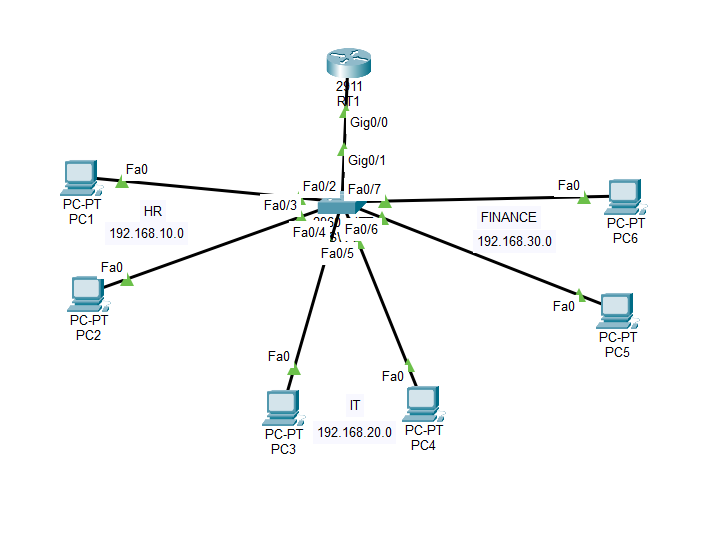

# Enterprise Network - Cisco Packet Tracer

## 📌 Project Overview

This project demonstrates the implementation of a small enterprise network using Cisco Packet Tracer.

The network consists of three departments:

- Human Resources (HR)
- Information Technology (IT)
- Finance

The project implements VLAN segmentation, Inter-VLAN Routing, DHCP, ACL, and SSH for secure administration.

---

## 🖥️ Network Topology

---

## 🚀 Technologies Used

- Cisco Packet Tracer
- VLAN
- IEEE 802.1Q Trunk
- Router-on-a-Stick
- DHCP
- Access Control Lists (ACL)
- SSH
- Cisco IOS

---

## 🌐 IP Addressing

| VLAN | Department | Network | Gateway |
|------|------------|---------|---------|
|10|HR|192.168.10.0/24|192.168.10.1|
|20|IT|192.168.20.0/24|192.168.20.1|
|30|Finance|192.168.30.0/24|192.168.30.1|

---

## 🔒 Security Policy

- HR cannot access Finance.
- Finance cannot access HR.
- IT has unrestricted access.
- SSH is enabled for secure remote management.

---

## 📂 Project Files

- Enterprise_Network.pkt
- Router Configuration
- Switch Configuration
- Network Topology
- Screenshots

---

## 🛠 Skills Demonstrated

- VLAN Configuration
- Inter-VLAN Routing
- DHCP Configuration
- ACL Implementation
- SSH Configuration
- Cisco IOS CLI

---

## 👨‍💻 Author

**Emin Sultanov**
